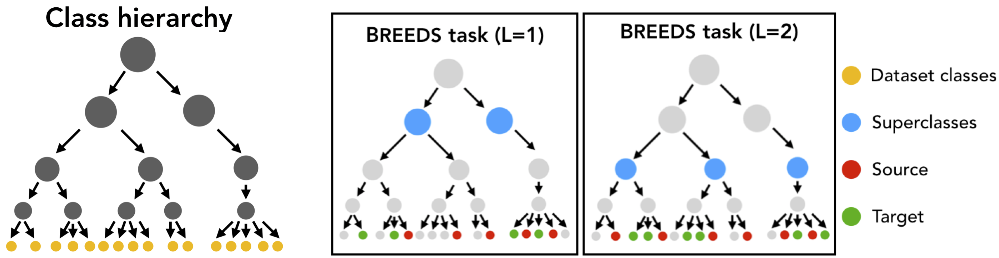
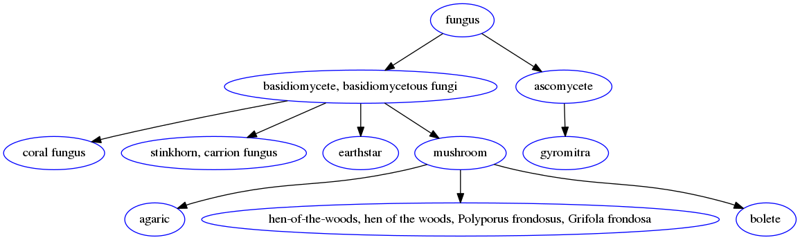

Creating BREEDS subpopulation shift benchmarks
===============================================

In this document, we will discuss how to create BREEDS datasets [STM20]_.
Given any existing dataset that comes with a class hierarchy (e.g. ImageNet, 
OpenImages), the BREEDS methodology allows you to make a derivative
classification task that can be used to measure robustness to subpopulation
shift. To do this, we:

1. Group together semantically-simlar classes ("breeds") in the dataset 
   into superclasses.
2. Define a classification task in terms of these superclasses---with 
   the twist that the "breeds" used in the training set from each superclasses 
   are disjoint from the "breeds" used in the test set. 

As a primitive example, one could take ImageNet (which contains many classes
corresponding to cat and dog breeds), and use the BREEDS methodology to come up
with a derivative "cats vs. dogs" task, where the training set would contain one
set of breeds (e.g., Egyptian cat and Tabby Cat vs. Labrador and Golden
Retriever) and the test set would contain another set (e.g. Persian cat and
alley cat vs Mastiff and Poodle). Here is a pictorial illustration of the BREEDS
approach:

This methodology allows you to create subpopulation shift benchmarks of varying
difficulty automatically, without having to manually group or split up classes,
and can be applied to any dataset which has a class hierarchy. In this
walkthrough, we will use ImageNet and the corresponding class hierarchy from
[STM20]_.

.. raw:: html

   <i class="fa fa-play"></i> &nbsp;&nbsp; <a
   href="https://github.com/MadryLab/BREEDS-Benchmarks/blob/master/Constructing%20BREEDS%20datasets.ipynb">Download
   a Jupyter notebook</a> containing all the code from this walkthrough!  
    

Requirements/Setup
''''''''''''''''''
To create BREEDS datasets using ImageNet, we need to create a: 

- ``data_dir`` which contains the ImageNet dataset  
  in PyTorch-readable format.
- ``info_dir`` which contains the following information (files) about 
  the class hierarchy:

  - ``dataset_class_info.json``: A list whose entries are triplets of
    class number, class ID and class name, for each dataset class.
  - ``class_hierarchy.txt``: Every line denotes an edge---parent ID followed by 
    child ID (space separated)---in the class hierarchy. 
  - ``node_names.txt``: Each line contains the ID of a node followed by
    it's name (tab separated).

For convenience, we provide the relevant files for the (modified) class
hierarchy `here
<https://github.com/MadryLab/BREEDS-Benchmarks/tree/master/imagenet_class_hierarchy/modified>`_.
You can manually download them and move them to ``info_dir`` or do it
automatically by specifying an empty ``info_dir`` to
:meth:`~robustness.tools.breeds_helpers.BreedsDatasetGenerator.get_superclasses`:

.. code-block:: python

   from robustness.tools.breeds_helpers import setup_breeds

   setup_breeds(info_dir)

Part 1: Browsing through the Class Hierarchy
''''''''''''''''''''''''''''''''''''''''''''

We can use :class:`~robustness.tools.breeds_helpers.ClassHierarchy` to
examine a dataset's (here, ImageNet) class hierarchy. Here, ``info_dir`` 
should contain the requisite files for the class hierarchy (from the Setup
step):

.. code-block:: python

   from robustness.tools.breeds_helpers import ClassHierarchy
   import numpy as np

   hier = ClassHierarchy(info_dir)
   print(f"# Levels in hierarchy: {np.max(list(hier.level_to_nodes.keys()))}")
   print(f"# Nodes/level:",
      [f"Level {k}: {len(v)}" for k, v in hier.level_to_nodes.items()])

The :samp:`hier` object has a ``graph`` attribute, which represents the class
hierarchy as a ``networkx`` graph. In this graph, the children of a node
correspond to its subclasses (e.g., Labrador would be a child of the dog
class in our primitive example). Note that all the original dataset classes 
will be the leaves of this graph. 

We can then use this graph to define superclasses---all nodes at a user-specified 
depth from the root node. For example:

.. code-block:: python

  level = 2 # Could be any number smaller than max level
  superclasses = hier.get_nodes_at_level(level)
  print(f"Superclasses at level {level}:\n")
  print(", ".join([f"{hier.HIER_NODE_NAME[s]}" for s in superclasses]))

Each superclass is made up of multiple "breeds", which simply correspond to
the leaves (original dataset classes) that are its descendants in the class
hierarchy:

.. code-block:: python

  idx = np.random.randint(0, len(superclasses), 1)[0]
  superclass = list(superclasses)[idx]
  subclasses = hier.leaves_reachable(superclass)
  print(f"Superclass: {hier.HIER_NODE_NAME[superclass]}\n")

  print(f"Subclasses ({len(subclasses)}):")
  print([f"{hier.LEAF_ID_TO_NAME[l]}" for l in list(subclasses)])

We can also visualize subtrees of the graph with the help of
the `networkx` and `pygraphviz` packages. For instance, we can
taks a look at the subtree of the class hierarchy rooted at a
particular superclass:

.. code-block:: python

  import networkx as nx
  from networkx.drawing.nx_agraph import graphviz_layout, to_agraph
  import pygraphviz as pgv
  from IPython.display import Image

  subtree = nx.ego_graph(hier.graph, superclass, radius=10)
  mapping = {n: hier.HIER_NODE_NAME[n] for n in subtree.nodes()}
  subtree = to_agraph(nx.relabel_nodes(subtree, mapping))
  subtree.delete_edge(subtree.edges()[0])
  subtree.layout('dot')
  subtree.node_attr['color']='blue'
  subtree.draw('graph.png', format='png')
  Image('graph.png')
  
For instance, visualizing tree rooted at the ``fungus`` superclass yields:

Part 2: Creating BREEDS Datasets
'''''''''''''''''''''''''''''''''

To create a dataset composed of superclasses, we use the 
:class:`~robustness.tools.breeds_helpers.BreedsDatasetGenerator`.
Internally, this class instantiates an object of 
:class:`~robustness.tools.breeds_helpers.ClassHierarchy` and uses it
to define the superclasses. 

.. code-block:: python

  from robustness.tools.breeds_helpers import BreedsDatasetGenerator

  DG = BreedsDatasetGenerator(info_dir)

Specifically, we will use  
:meth:`~robustness.tools.breeds_helpers.BreedsDatasetGenerator.get_superclasses`.
This function takes in the following arguments (see :meth:`this docstring
<robustness.tools.breeds_helpers.BreedsDatasetGenerator.get_superclasses>` for more details):

- :samp:`level`: Level in the hierarchy (in terms of distance from the
  root node) at which to define superclasses.
- :samp:`Nsubclasses`: Controls the minimum number of subclasses/superclass
  in the dataset. If None, it is automatically set to be the size (in terms
  of subclasses) of the smallest superclass. 
- :samp:`split`: If ``None``, subclasses of a superclass are returned 
  as is, without partitioning them into the source and target domains. 
  Else, can be ``rand/good/bad`` depending on whether the subclass split should be
  random or less/more adversarially chosen (see paper for details).
- :samp:`ancestor`: If a node ID is specified, superclasses are chosen from 
  subtree of class hierarchy rooted at this node. Else, if None, :samp:`ancestor`
  is set to be the root node.
- :samp:`balanced`: If True, subclasses/superclass is fixed over superclasses.

For instance, we could create a balanced dataset, with the subclass partition 
being less adversarial as follows:

.. code-block:: python

  ret = DG.get_superclasses(level=2, 
                        Nsubclasses=None, 
                        split="rand", 
                        ancestor=None, 
                        balanced=True)
  superclasses, subclass_split, label_map = ret                                 

This method returns:

- :samp:`superclasses` is a list containing the IDs of all the
  superclasses.
- :samp:`subclass_split` is a tuple of subclass ranges for
  the source and target domains. For instance,
  :samp:`subclass_split[0]` is a list, which for each superclass,
  contains a list of subclasses present in the source domain.
  If ``split=None``, subclass_split[1] is empty and can be
  ignored.
- :samp:`label_map` is a dictionary mapping a superclass
  number (label) to name. 

You can experiment with these parameters to create datasets of different
granularity. For instance, you could specify the :samp:`Nsubclasses` to
restrict the size of every superclass in the dataset,
set the :samp:`ancestor` to be a specific node (e.g., ``n00004258`` 
to focus on living things), or set :samp:`balanced` to ``False`` 
to get an imbalanced dataset.

We can take a closer look at the composition of the dataset---what
superclasses/subclasses it contains---using:

.. code-block:: python

  from robustness.tools.breeds_helpers import print_dataset_info

  print_dataset_info(superclasses, 
                     subclass_split, 
                     label_map, 
                     hier.LEAF_NUM_TO_NAME)

Finally, for the source and target domains, we can create datasets
and their corresponding loaders:

.. code-block:: python

  from robustness import datasets
  
  train_subclasses, test_subclasses = subclass_split

  dataset_source = datasets.CustomImageNet(data_dir, train_subclasses)
  loaders_source = dataset_source.make_loaders(num_workers, batch_size)
  train_loader_source, val_loader_source = loaders_source

  dataset_target = datasets.CustomImageNet(data_dir, test_subclasses)
  loaders_target = dataset_source.make_loaders(num_workers, batch_size)
  train_loader_target, val_loader_target = loaders_target

You're all set! You can then use this dataset and loaders
just as you would any other existing/custom dataset in the robustness 
library. For instance, you can visualize validation set samples from
both domains and their labels using:

.. code-block:: python

  from robustness.tools.vis_tools import show_image_row

  for domain, loader in zip(["Source", "Target"],
                            [val_loader_source, val_loader_target]):
      im, lab = next(iter(loader))
      show_image_row([im], 
                     tlist=[[label_map[int(k)].split(",")[0] for k in lab]],
                     ylist=[domain],
                     fontsize=20)

You can also create superclass tasks where subclasses are not 
partitioned across domains: 

.. code-block:: python

  ret = DG.get_superclasses(level=2, 
                            Nsubclasses=2, 
                            split=None, 
                            ancestor=None, 
                            balanced=True)
  superclasses, subclass_split, label_map = ret
  all_subclasses = subclass_split[0]

  dataset = datasets.CustomImageNet(data_dir, all_subclasses)

  print_dataset_info(superclasses,
                     subclass_split, 
                     label_map, 
                     hier.LEAF_NUM_TO_NAME)

Part 3: Loading in-built BREEDS Datasets
''''''''''''''''''''''''''''''''''''''''

Alternatively, we can directly use one of the datasets from our paper 
[STM20]_---namely ``Entity13``, ``Entity30``, ``Living17`` 
and ``Nonliving26``. Loading any of these datasets is relatively simple:

.. code-block:: python

  from robustness.tools.breeds_helpers import make_living17
  ret = make_living17(info_dir, split="rand")
  superclasses, subclass_split, label_map = ret

  print_dataset_info(superclasses, 
                     subclass_split,
                     label_map, 
                     hier.LEAF_NUM_TO_NAME)

You can then use a similar methodology to Part 2 above to probe
dataset information and create datasets and loaders.

