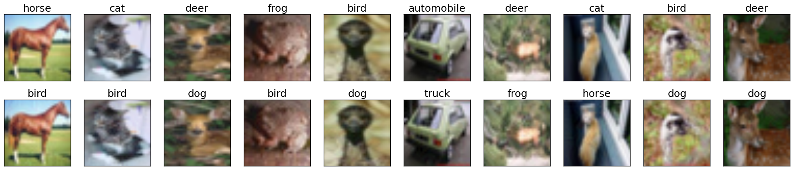
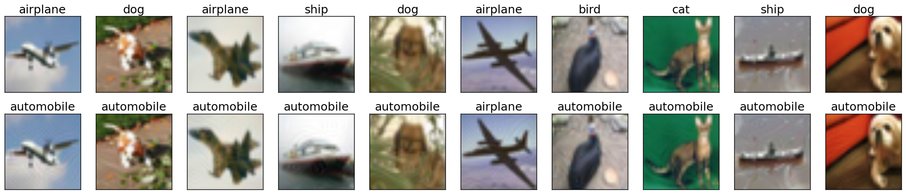
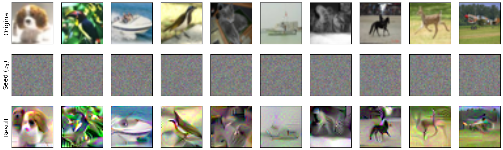
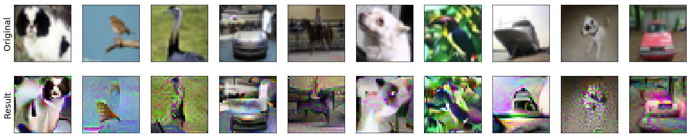

Input manipulation with pre-trained models
===========================================

The robustness library provides functionality to perform various input space
manipulations using a trained model. This ranges from basic manipulation such
as creating untargeted and targeted adversarial examples, to more
advanced/custom ones. These types of manipulations are precisely what we use in
the `code <https://git.io/robust-reps>`_ `releases
<https://git.io/robust-apps>`_ for our papers [EIS+19]_ and [STE+19]_.

.. raw:: html

   <i class="fa fa-play"></i> &nbsp;&nbsp; <a
   href="https://github.com/MadryLab/robustness/blob/master/notebooks/Input%20manipulation%20with%20pre-trained%20models.ipynb">Download
   a Jupyter notebook</a> containing all the code from this walkthrough!  
    

Generating Untargeted Adversarial Examples
------------------------------------------

First, we will go through an example of how to create untargeted adversarial
examples for a ResNet-50 on the dataset CIFAR-10.

1. Load the dataset using::
   
      import torch as ch
      from robustness.datasets import CIFAR
      ds = CIFAR('/path/to/cifar')

2. Restore the pre-trained model using::

      from robustness.model_utils import make_and_restore_model
      model, _ = make_and_restore_model(arch='resnet50', dataset=ds, 
                   resume_path=PATH_TO_MODEL)
      model.eval()

3. Create a loader to iterate through the test set (set hyperparameters
   appropriately). Get a batch of test image-label pairs::

      _, test_loader = ds.make_loaders(workers=NUM_WORKERS, 
                                          batch_size=BATCH_SIZE)
      _, (im, label) = next(enumerate(test_loader))

4. Define attack parameters (see
   :meth:`robustness.attacker.AttackerModel.forward` for documentation on these
   parameters)::

         kwargs = {
             'constraint':'2', # use L2-PGD
             'eps': ATTACK_EPS, # L2 radius around original image
             'step_size': ATTACK_STEPSIZE, 
             'iterations': ATTACK_STEPS, 
             'do_tqdm': True,
         }

   The example considers a standard PGD attack on the
   cross-entropy loss. The parameters that you might want to customize are 
   :samp:`constraint` (:samp:`'2'` and :samp:`'inf'` are supported), :samp:`'attack_eps'`,
   :samp:`'step_size'` and :samp:`'iterations'`.

5. Find adversarial examples for :samp:`im` from step 3::

      _, im_adv = model(im, label, make_adv=True, **kwargs)

6. If we want to visualize adversarial examples :samp:`im_adv` from step 5, we
   can use the utilities provided in the :mod:`robustness.tools` module::

      from robustness.tools.vis_tools import show_image_row
      from robustness.tools.label_maps import CLASS_DICT

      # Get predicted labels for adversarial examples
      pred, _ = model(im_adv)
      label_pred = ch.argmax(pred, dim=1)
      
      # Visualize test set images, along with corresponding adversarial examples
      show_image_row([im.cpu(), im_adv.cpu()], 
               tlist=[[CLASS_DICT['CIFAR'][int(t)] for t in l] for l in [label, label_pred]],
               fontsize=18,
               filename='./adversarial_example_CIFAR.png')

Here is a sample output visualization snippet from step 6:

   Random samples from the CIFAR-10 test set (top row), along with their corresponding
   untargeted adversarial examples (bottom row). Image titles correspond to ground truth 
   labels and predicted labels for the top and bottom row respectively.

Generating Targeted Adversarial Examples
----------------------------------------

The procedure for creating untargeted and targeted adversarial examples using
the robustness library are very similar. In fact, we will start by repeating
steps 1-3 describe above. The rest of the procedure is as follows (most of it
involves minor modifications to steps 4-5 above):

1. Define attack parameters::

      kwargs = {
          'constraint':'2',
          'eps': ATTACK_EPS,
          'step_size': ATTACK_STEPSIZE,
          'iterations': ATTACK_STEPS, 
          'targeted': True,
          'do_tqdm': True
      }

   The key difference from step 4 above is the inclusion of an additional parameter
   :samp:`'targeted'` which is set to :samp:`True` in this case. 

2. Define target classes towards which we want to perturb :samp:`im`.
   For instance, we can perturb all the images towards class :samp:`0`::

      targ = ch.zeros_like(label)

3. Find adversarial examples for :samp:`im`::

      _, im_adv = model(im, targ, make_adv=True, **kwargs)

If you would like to visualize the targeted adversarial examples, you can repeat
the aforementioned step 6, i.e. the
:meth:`robustness.tools.vis_tools.show_image_row` method:

   Random samples from the CIFAR-10 test set (top row), along with their corresponding
   targeted adversarial examples (bottom row). Image titles correspond to ground truth 
   labels and predicted labels (target labels) for the top and bottom row respectively.

Custom Input Manipulation (e.g. Representation Inversion)
---------------------------------------------------------

You can also use the robustness lib functionality to perform input
manipulations beyond  adversarial attacks. In order to do this, you will need to
define a custom loss function (to replace the default
:samp:`ch.nn.CrossEntropyLoss`).

We will now walk through an example of defining a custom loss for inverting the
representation (output of the pre-final network layer, before the linear
classifier) for a given image.  Specifically, given the representation for an
image, our goal is to find (starting from noise) an  input whose representation
is close by (in terms of euclidean distance).

First, we will repeat steps 1-3 from the procedure for generating untargeted
adversarial examples. 

1. Load a set of images to invert and find their representation. Here we 
   choose random samples from the test set::

      _, (im_inv, label_inv) = next(enumerate(test_loader)) # Images to invert
      with ch.no_grad():
          (_, rep_inv), _ = model(im_inv, with_latent=True) # Corresponding representation

2. We now define a custom loss function that penalizes difference from a 
   target representation :samp:`targ`::

      def inversion_loss(model, inp, targ):
         # Compute representation for the input
         _, rep = model(inp, with_latent=True, fake_relu=True) 
         # Normalized L2 error w.r.t. the target representation
         loss = ch.div(ch.norm(rep - targ, dim=1), ch.norm(targ, dim=1))
         return loss, None

3. We are now ready to define the attack args :samp: `kwargs`. This time we will
   supply our custom loss :samp:`inversion_loss`::

      kwargs = {
          'custom_loss': inversion_loss,
          'constraint':'2',
          'eps': 1000,
          'step_size': 1,
          'iterations': 10000, 
          'targeted': True,
          'do_tqdm': True,
      }

4. We now define a seed input which will be the starting point for our inversion process. We will
   just use a gray image with (scaled) Gaussian noise::

      im_seed = ch.clamp(ch.randn_like(im_inv) / 20 + 0.5, 0, 1)

5. Finally, we are ready to perform the inversion::

      _, im_matched = model(im_seed, rep_inv, make_adv=True, **kwargs) 

6. We can also visualize the results of the inversion process (similar to step 6 above):::

      show_image_row([im_inv.cpu(), im_seed.cpu(), im_matched.cpu()], 
               ["Original", r"Seed ($x_0$)", "Result"],
               fontsize=18,
               filename="./custom_inversion_CIFAR.png")

You should see something like this:

   Inverting representations of a robust network. Starting from the seed (middle row), we optimize 
   for an image (bottom row) that is close to the representation of the original image (top row).

Changing optimization methods
"""""""""""""""""""""""""""""
In the above, we consistently used L2-PGD for all of our optimization tasks, as
dictated by the value of the ``constraint`` argument to the model. However,
there are a few more possible optimization methods available in the
``robustness`` package by default. We give a brief overview of them here---the
:mod:`robustness.attack_steps` module has more in-depth documentation on each
method:

- If ``kwargs['constraint'] == '2'`` (as it was for this walkthrough), then
  ``eps`` is interpreted as an L2-norm constraint, and we take
  :math:`\ell_2`-normalized gradient steps. More information at
  :class:`robustness.attack_steps.L2Step`.  
- If ``kwargs['constraint'] == 'inf'``, then ``eps`` is interpreted as an
  :math:`\ell_\infty` norm constraint, and we take
  :math:`\ell_\infty`-normalized PGD steps (i.e. signed gradient steps). More
  information at :class:`robustness.attack_steps.LinfStep`.
- If ``kwargs['constraint'] == 'unconstrained'``, then ``eps`` is ignored and
  the adversarial image is only clipped to the [0, 1] range. The optimization
  method is ordinary gradient descent, i.e., no projection is done to the
  gradient before making a step.
- If ``kwargs['constraint'] == 'fourier'``, then ``eps`` is ignored and the
  adversarial image is only clipped to the [0, 1] range. The optimization method
  is once again ordinary gradient descent, but this time in the Fourier basis
  rather than the pixel basis. This tends to yield nicer-looking
  images, for reasons discussed `here
  <https://distill.pub/2017/feature-visualization/#preconditioning>`_ [OMS17]_.

For example, in order to do representation inversion in the fourier basis rather
than the pixel basis, we would change ``kwargs`` as follows:

.. code-block:: python

      kwargs = {
          'custom_loss': inversion_loss,
          'constraint':'fourier',
          'eps': 1000, # ignored anyways
          'step_size':  5000, # have to re-tune LR
          'iterations': 1000, 
          'targeted': True,
          'do_tqdm': True,
      }

We also have to change our ``im_seed`` to be a valid Fourier-basis
parameterization of an image:

.. code-block:: python
   
   im_seed = ch.randn(BATCH_SIZE, 3, 32, 32, 2) / 5 # Parameterizes a grey image

Running this through the model just like before and visualizing the results should
yield something like:

.. code-block:: python

   show_image_row([im_inv.cpu(), im_matched.cpu()],
         ["Original", "Result"],
         fontsize=18,
         filename='./custom_inversion_CIFAR_fourier.png')

      in the fourier basis.

   Inverting representations of a robust network in the fourier basis. Starting
   from the seed (middle row), we optimize for an image (bottom row) that is
   close to the representation of the original image (top row).

:ref:`Below <adding-custom-steps>` we show how to implement our own custom optimization methods as
well.

.. [OMS17] Olah, et al., "Feature Visualization", Distill, 2017.

Advanced usage
----------------

The steps given above are sufficient for using the :samp:`robustness` library
for a wide a variety of input manipulation techniques, and for reproducing the
code for our papers. Here we go through a couple more advanced options and
techniques for using the library.

Gradient Estimation/NES
"""""""""""""""""""""""
The first more advanced option we look at is how to use estimated gradients
in place of real ones when doing adversarial attacks (this corresponds to the
NES black-box attack [IEA+18]_). To do this, we simply need to provide the
``est_grad`` argument (``None`` by default) to the model upon creation of the
adversarial example. As discussed in :meth:`this docstring
<robustness.attacker.Attacker.forward>`, the proper format for this argument is
a tuple of the form ``(R, N)``, and the resulting gradient estimator is

.. math:: 

    \nabla_x f(x) \approx \sum_{i=0}^N f(x + R\cdot \vec{\delta_i})\cdot
    \vec{\delta_i},

where :math:`\delta_i` are randomly sampled from the unit ball (note that we
employ antithetic sampling to reduce variance, meaning that we actually draw
:math:`N/2` random vectors from the unit ball, and then use
:math:`\delta_{N/2+i} = -\delta_{i}`.

To do representation inversion with NES/estimated gradients, we would just need
to add the following line to the above:

.. code-block:: python
   
   kwargs['est_grad'] = (0.5, 100)

This will run the optimization process using 100-query gradient estimates with
:math:`R = 0.5` in the above estimator.

.. [IEA+18] Ilyas, A., Engstrom, L., Athalye, A., & Lin, J. (2018). Black-box
   adversarial attacks with limited queries and information. arXiv preprint
   arXiv:1804.08598.

.. _adding-custom-steps:

Custom optimization methods
"""""""""""""""""""""""""""
To make a custom optimization method, all that is required is to subclass
:class:`robustness.attack_steps.AttackerStep` class. The class documentation has
information about which methods and properties need to be implemented, but
perhaps the most illustrative thing is an example of how to implement the
:math:`\ell_2`-PGD attacker:

.. code-block:: python

   class L2Step(AttackerStep):
      def project(self, x):
         diff = x - self.orig_input
         diff = diff.renorm(p=2, dim=0, maxnorm=self.eps)
         return ch.clamp(self.orig_input + diff, 0, 1)

      def step(self, x, g):
         # Scale g so that each element of the batch is at least norm 1
         l = len(x.shape) - 1
         g_norm = ch.norm(g.view(g.shape[0], -1), dim=1).view(-1, *([1]*l))
         scaled_g = g / (g_norm + 1e-10)
         return x + scaled_g * self.step_size

      def random_perturb(self, x):
         new_x = x + (ch.rand_like(x) - 0.5).renorm(p=2, dim=1, maxnorm=self.eps)
         return ch.clamp(new_x, 0, 1)

      def to_image(self, x):
         return x

As part of initialization, the properties ``self.orig_input``, ``self.eps``, and
``self.step_size``, and ``self.use_grad`` will already be defined.  As shown
above, there are four functions that your custom step can implement (three of
which, ``project``, ``step``, and ``random_perturb``, are mandatory). 

- The ``project`` function takes in an input ``x`` and projects it to the
  appropriate ball around ``self.orig_input``. 
- The ``step`` function takes in a current input and a gradient, and outputs the
  next iterate of the optimization process (in our case, we normalize the
  gradient and then add it to the iterate to perform an :math:`\ell_2` projected
  gradient ascent step). 
- The ``random_perturb`` function is called if the ``random_start`` option is
  given when constructing the adversarial example. Given an input, it should
  apply a small random perturbation to the input while still keeping it within
  the adversarial budget.
- The ``to_image`` function is identity by default, but is useful when working
  with alternative parameterizations of images. For example, when optimizing in
  Fourier space, the ``to_image`` function takes in an input which is in the
  Fourier basis, and outputs a valid image.

